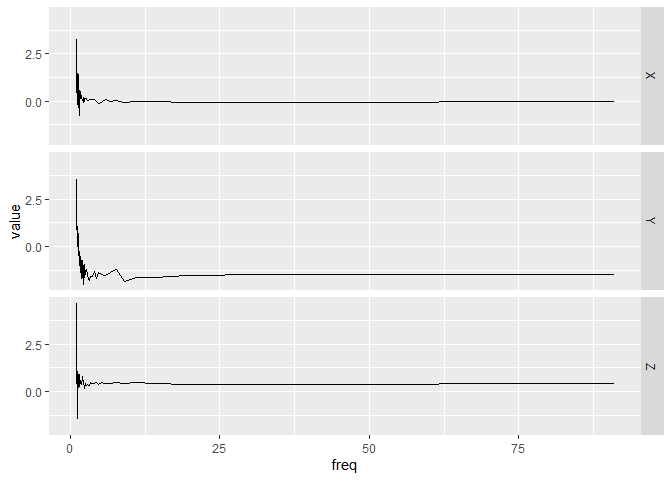

<!-- README.md is generated from README.Rmd. Please edit that file -->

# bis620.2022

<!-- badges: start -->

[](https://github.com/bluestme/bis620.2022/actions/workflows/R-CMD-check.yaml)
[](https://codecov.io/gh/bluestme/bis620.2022)
[](https://github.com/bluestme/bis620.2022/actions/workflows/test-coverage.yaml)
[](https://github.com/bluestme/bis620.2022/actions/workflows/lint.yaml)
<!-- badges: end -->

The goal of bis620.2022 is to analyze the Accelerometry Data. It
contains the dataset of a toy accelerometry dataset from UKBiobank where
x is an object inherited from data.frame. It is assumed to have a time,
X, Y, and Z column along with either a time or freq column.

Two related functions are included, with one calculating spectral
signature by taking the modulus of the Fourier coefficients of the
signal and one plot function and one plotting UKBiobank Accelerometry
Data.

## Installation

You can install the development version of bis620.2022 from
[GitHub](https://github.com/) with:

``` r
# install.packages("devtools")
devtools::install_github("bluestme/bis620.2022")
```

## Usage

We first display the usage of plot

``` r
library(bis620.2022)
data("ukb_accel")
p <- ukb_accel[1:100, ]
spectral <- spectral_signature(p, take_log = TRUE)
accel_plot(spectral)
```



We then display the usage of signature

``` r
b <- spectral_signature(p)
head(b)
#> # A tibble: 6 × 4
#>       X     Y       Z  freq
#>   <dbl> <dbl>   <dbl> <dbl>
#> 1 19.8  33.7  103.     1.01
#> 2 26.0   4.23   4.18   1.03
#> 3  8.14  4.23   9.58   1.05
#> 4  7.50  3.91   4.86   1.08
#> 5  1.55  2.74   2.73   1.10
#> 6  4.32  2.09   0.820  1.12
```
